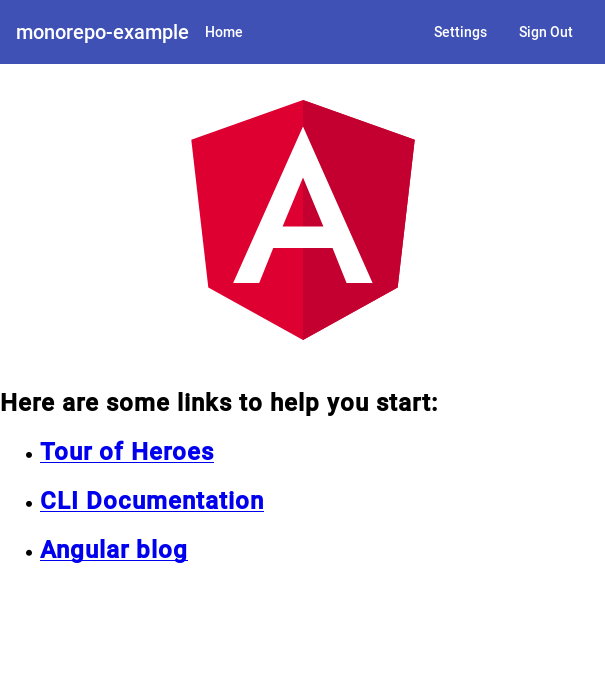

# monorepo-example

## Build instructions

(Instructions written within a Linux environment!)

1. First run `yarn` and install all dependencies in each project: `monorepo-example-api`, `monorepo-example-www` and `shared`
2. Build our local dependencies first buy running `yarn build` in the `shared` project.
3. Create a GitHub application to get a `client_id` and a `client_secret` to use in the next step.
4. Make a file called `.env` based off of the `.env-template` file in the `monorepo-example-api` project (use your client info from the previous step!)
5. Run `yarn start:dev` in the `monorepo-example-api` project.
6. (In another terminal) run `yarn start` in the `monorepo-example-www` project.
7. Visit `http://localhost:4200` in your browser.
8. Sign into your application via GitHub and see the 'Sign In' button turn to a 'Sign Out' button.
